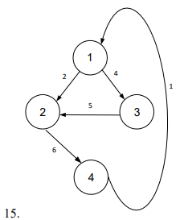
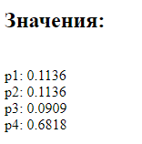
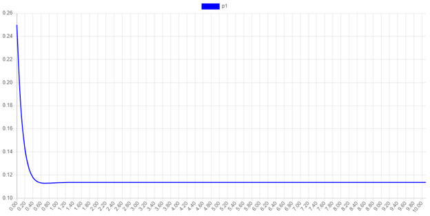
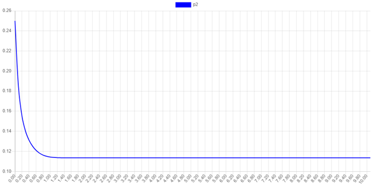
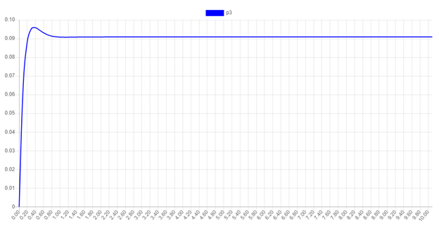
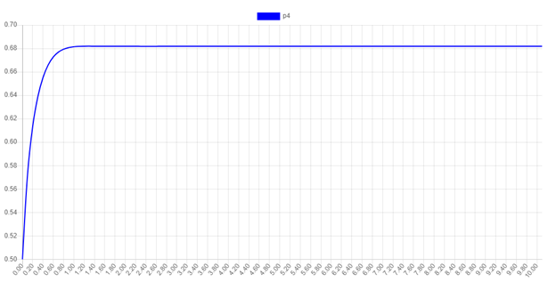

## Задание
Рассматривается система с дискретными состояниями и непрерывным временем. 
Заданы размеченный граф состояний и интенсивности переходов. 
Все потоки событий простейшие

  

 

1. составьте матрицу интенсивностей переходов;
2. составьте систему дифференциальных уравнений Колмогорова для вероятностей состояний; решите ее методом <strong>Рунге-Кутта</strong>;
3. найдите предельное распределение вероятностей;
4. разработайте алгоритм и программу для расчёта на ЭМВ. 

------

Предельные значния:  
  

------

### Графики ф-ции

  
  
  
  